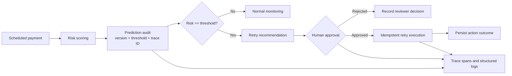

# DirectDebit IQ

**Auditable direct-debit risk and retry automation with MLflow, SQL, CI, and human review.**

[](https://github.com/RidhanPar/directdebit-iq/actions/workflows/ci.yml)


[Open live dashboard](https://directdebit-iq.streamlit.app/) | [API documentation](docs/API.md) | [Security and governance](docs/SECURITY_AND_GOVERNANCE.md) | [Evaluation scorecard](docs/EVALUATION_SCORECARD.md)

DirectDebit IQ predicts scheduled payment failures, explains the risk, recommends a retry, and turns high-risk scores into governed operational actions. Customer-impacting retries require a reviewer decision, carry an idempotency key, and produce queryable audit and trace evidence. The risk and retry logic is directly analogous to card authorisation and retry strategies in card acquiring environments — making the project relevant to any team managing payment failure rates and transaction recovery.

> **Evidence boundary:** the dataset and financial benefit estimates are synthetic scenarios. The project demonstrates engineering, analytics, and governance controls; it does not claim validated production performance or guaranteed financial return.

The retry strategy this system recommends is exactly what gets tested end to end in
[payment-retry-ab-test](https://github.com/RidhanPar/payment-retry-ab-test), a full A/B test
readout on whether a smart retry timing strategy actually recovers more failed payments than a
fixed schedule.

## Five-Minute Review

| Capability | Evidence |
|---|---|
| Risk model and out-of-time evaluation | [`src/train.py`](src/train.py), [`docs/MODEL_CARD.md`](docs/MODEL_CARD.md) |
| SQL analytics and reproducible feature pipeline | [`sql/`](sql/), [`src/feature_store.py`](src/feature_store.py) |
| Stakeholder dashboard and modular page boundary | [`app/dashboard.py`](app/dashboard.py), [`app/pages.py`](app/pages.py), [`app/automation_page.py`](app/automation_page.py), [`app/action_api_client.py`](app/action_api_client.py) |
| Authenticated action API | [`api/main.py`](api/main.py), [`api/auth.py`](api/auth.py) |
| Human approval and retry-scheduling workflow | [`api/service.py`](api/service.py), [`automation/n8n_retry_approval_workflow.json`](automation/n8n_retry_approval_workflow.json) |
| Prediction, reviewer, and action audit records | [`api/models.py`](api/models.py) |
| Trace IDs, structured logs, and persisted spans | [`api/observability.py`](api/observability.py) |
| Approval-safe optional LLM planner | [`src/operations_agent.py`](src/operations_agent.py) |
| Automated governance evaluation | [`evaluations/run_action_evaluation.py`](evaluations/run_action_evaluation.py), [`evaluations/results/action_workflow_results.json`](evaluations/results/action_workflow_results.json) |
| Tests, CI, containers, and cloud blueprint | [`tests/`](tests/), [`.github/workflows/ci.yml`](.github/workflows/ci.yml), [`render.yaml`](render.yaml) |

## Score-to-Action Architecture



The n8n workflow calls the same authenticated endpoints used by tests and the API documentation. It cannot execute a retry until a user with the `reviewer` or `admin` role records approval.

## Key Results

| Metric | Synthetic holdout result |
|---|---:|
| Dataset size | 50,000 payments |
| ROC AUC | ~0.690 |
| Average precision | ~0.296 |
| Recall at threshold 0.30 | ~94.5% |
| Governance evaluation | 7/7 controls passing |

Model metrics are from an out-of-time synthetic holdout. Benefit and ROI values in [`docs/BUSINESS_IMPACT.md`](docs/BUSINESS_IMPACT.md) are explicitly scenario estimates.

## Payment Operations Context

- Direct debit failures map to card decline scenarios in acquiring
- The retry governance workflow mirrors chargeback and dispute handling logic
- The audit trail (prediction → approval → execution → outcome) is the same pattern used in card network compliance reporting
- KPIs tracked (failure rate, retry recovery rate, reviewer decision time) are the same metrics used by payment operations teams

## Quick Start

```bash
git clone https://github.com/RidhanPar/directdebit-iq.git
cd directdebit-iq
python -m venv .venv
# Windows: .venv\Scripts\activate
# macOS/Linux: source .venv/bin/activate
pip install -r requirements.txt
python data/generate_data.py
pytest -q
python evaluations/run_action_evaluation.py
```

Run the dashboard and action API in separate terminals:

```bash
streamlit run streamlit_app.py
uvicorn api.main:app --reload --port 8000
```

Open:

- Dashboard: `http://localhost:8501`
- Action API docs: `http://localhost:8000/docs`
- Action API health: `http://localhost:8000/health`

Or start Streamlit, FastAPI, MLflow, and n8n together:

```bash
docker compose up --build
```

## API Example

Local demo users are `operator`, `reviewer`, and `admin`; each local-only password follows `<username>-demo`. Configure real identity and secrets before production use.

```bash
curl -X POST http://localhost:8000/auth/token \
  -H "Content-Type: application/x-www-form-urlencoded" \
  -d "username=operator&password=operator-demo"
```

```bash
curl -X POST http://localhost:8000/predictions \
  -H "Authorization: Bearer <operator-token>" \
  -H "Content-Type: application/json" \
  -d '{
    "payment_id": "PAY-1001",
    "payment_amount": 850,
    "payment_date": "2026-06-16",
    "mandate_age_days": 12,
    "previous_failure_count": 4,
    "estimated_balance_band": "low",
    "days_since_last_success": 75
  }'
```

The response includes the prediction version, threshold, trace ID, recommendation, and a pending approval action ID when risk exceeds the action threshold.

## Governance Evaluation

Run:

```bash
python evaluations/run_action_evaluation.py
```

The deterministic suite fails CI unless every specified workflow control passes:

1. High-risk routing to approval
2. Low-risk no-action behavior
3. Role-based access control
4. Approval-gate enforcement
5. Idempotent execution
6. Complete audit and trace evidence
7. Approval-safe agent planning

The checked-in result reports the pass rate for these seven declared governance controls. It is separate from predictive-model accuracy.

## Technology

| Layer | Technology |
|---|---|
| Analytics and ML | Python, pandas, SQL, XGBoost, scikit-learn, SHAP |
| Model lifecycle | MLflow, out-of-time holdout, model card |
| Product surfaces | Streamlit, FastAPI, OpenAPI |
| Data Layer | SQLAlchemy, dbt models, SQLite locally, PostgreSQL on Render |
| Automation | n8n, optional OpenAI structured planner |
| Governance | JWT/RBAC, human approval, audit events, idempotency |
| Observability | Trace IDs, JSON logs, persisted spans |
| Delivery | Docker Compose, GitHub Actions, Render Blueprint |

## Repository Map

```text
api/                 Authenticated prediction/action API and governance services
app/                 Thin dashboard entrypoint, product pages, and API client
automation/          Importable n8n approval/retry workflow
data/                Synthetic data generator and local artifacts
docs/                API, architecture, deployment, model, and governance evidence
evaluations/         Executable action-workflow control suite and results
sql/                 Payment operations analyses
src/                 Feature engineering, training, recommendations, and agent plan
tests/               Unit, integration, artifact, and smoke tests
render.yaml          Managed PostgreSQL and FastAPI cloud Blueprint
docker-compose.yml   Dashboard, action API, MLflow, and n8n stack
```

## Production Boundary

Before connecting to real payments:

- Replace demo users with an enterprise identity provider.
- Validate performance and calibration on governed historical data.
- Add database migrations, secret rotation, rate limiting, and encrypted backups.
- Complete privacy, fairness, operational-capacity, and rollback reviews.
- Start in shadow mode, then use a measured champion/challenger release.

See [`docs/SECURITY_AND_GOVERNANCE.md`](docs/SECURITY_AND_GOVERNANCE.md) for implemented controls and remaining production requirements.

## Portfolio Positioning

**Resume bullet:** Built a tested, Dockerized direct-debit risk platform using Python, SQL, XGBoost, and MLflow; achieved 94.5% recall on an out-of-time synthetic holdout and translated scores into prioritized retry recommendations.
