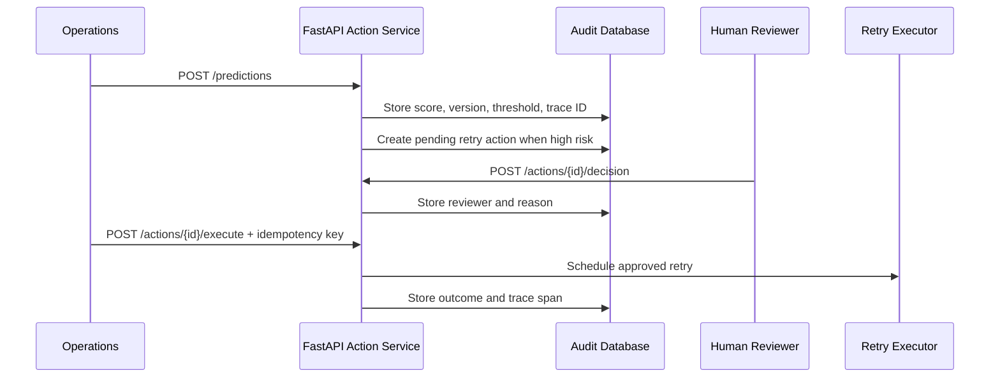

# Score-to-Action Automation

## Operational Path



## n8n

Import [`automation/n8n_retry_approval_workflow.json`](../automation/n8n_retry_approval_workflow.json), then configure:

```text
DDIQ_API_URL=http://action-api:8000
DDIQ_OPERATOR_JWT=<operator token>
DDIQ_REVIEWER_JWT=<reviewer token>
```

The workflow receives a payment webhook, creates a prediction, waits on high-risk cases, records a reviewer decision, and schedules only approved demo actions. It does not connect to a payment processor.

## Agent Planner

`src/operations_agent.py` optionally uses OpenAI structured output to propose a tool sequence. It validates every plan against a fixed tool catalog and rejects any retry execution that does not follow a human-approval step. Provider or validation failure produces a visible warning and a deterministic safe fallback.
